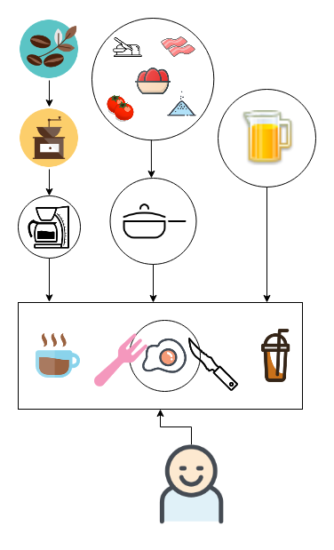

# Приготовление завтрака

Завтраком называют первый дневной приём пищи. Как правило, завтрак проходит в промежутке между 7 утра и полуднем. Преимущества хорошего завтрака:

   - насыщает организм до обеда;
   - улучшает настроение;
   - полезен для здоровья.

В статье приведён один из вариантов приготовления европейского (континентального) завтрака на одну персону:

- чёрный кофе;
- яичница;
- сок.

Чтобы приготовить такой завтрак, серьёзные кулинарные навыки не нужны. Примерное время приготовления: 10 минут.

Другие варианты завтраков вы можете выбрать, например, на сайте [russianfood.com](https://www.russianfood.com/recipes/bytype/?fid=926).

## Подготовка

1. Подготовьте продукты для завтрака:

    Продукт          | Количество |
    :----------------|:----------:|
    Яйца             | 2 шт.      |
    Масло сливочное  | 10 г       |
    Кофе в зёрнах    | 10 г       |
    Сок              | 200 мл     |
    Помидорры черри  | 4 шт.      |
    Бекон            | 75 г       |
    Соль             | по вкусу   |
    Сахар            | по вкусу   |
    Хлеб             | 1 кусочек  |

1. Проверьте наличие бытовой техники и приспособлений:
    - газовая или электрическая плита;
    - сковорода с крышкой;
    - кофемолка;
    - кофеварка;
    - деревянная лопатка.
1. Проверьте наличие посуды:
    - вилка;
    - нож;
    - ложка чайная;
    - кружка 300 мл;
    - стакан 200 мл;
    - тарелка.   
    
Чтобы завтрак получился вкусным:  

- используйте продукты с неистёкшим сроком годности;
- соблюдайте условия хранения продуктов.

Используйте бытовую технику в соответствии с инструкциями по эксплутации.

### Схема взаимодействия компонентов

## Как сварить кофе

### Операции с кофемолкой

1. Откройте крышку.
1. Засыпьте в чашу 10 г кофе.
1. Закройте крышку.
1. Нажмите и удерживайте кнопку около 15 секунд.
1. Отпустите кнопку.

### Операции с кофеваркой

1. Откройте крышку.
1. Вставьте бумажный фильтр в воронку.
1. Высыпьте в воронку кофе из кофемолки.
1. Залейте в резервуар 300 мл холодной воды.
1. Закройте крышку.
1. Переведите тумблер в положение "Вкл". Кофе будет готов примерно через 7 минут.

## Как пожарить яичницу

1. Помойте помидоры и разрежьте каждый на 2 части.
1. Включите плиту.
1. Поставьте сковороду на плиту.
1. Положите в сковороду 10 г сливочного масла.
1. Когда масло растает, распределите его по поверхности с помощью деревянной лопатки.
1. Положите на сковороду бекон и помидоры.
1. Примерно через 1 минуту переверните бекон и помидоры на другую сторону с помощью лопатки.
1. Аккуратно разбейте яйца и вылейте их содержимое на сковороду. Скорлупу выбросьте в мусорное ведро.
1. Посолите яйца по вкусу.
1. Закройте сковороду крышкой.
1. Когда яйца будут готовы, выключите плиту. Яйца можно считать готовыми, когда белок перестал быть жидким, а желтки покрылись белой плёнкой.

## Сервировка

1. Налейте кофе в кружку.
1. С помощью чайной ложки положите в кофе сахар по вкусу.
1. Положите яичницу в тарелку.
1. Положите вилку слева от тарелки.
1. Положите нож справа от тарелки.
1. Положите хлеб на край тарелки.
1. Налейте сок в стакан.

Чтобы съесть яичницу, используйте нож и вилку. Перед едой пожелайте себе приятного аппетита. 

