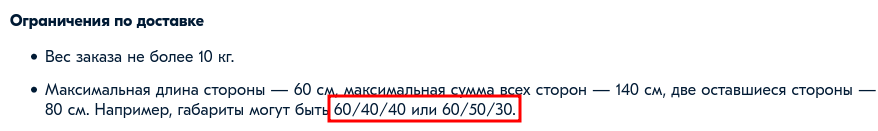

# Обратная связь по статье [Способы доставки](https://docs.ozon.ru/common/dostavka/sposoby-dostavki/)

1.   

    Для открытия карты лучше использовать ссылку. Например: `Карта пунктов выдачи (откроется в новой вкладке)`. Аналогично для карты постаматов.

1.   
    Текст абзаца должен оставаться читаемым, если убрать заголовок. Лучше переписать абзацы, которые начинаются с обрубленных предложений. Например: `Обычно для получения достаточно назвать номер заказа. Документ может понадобиться, если в заказе есть товар 18+.`

1.   
    Предложения с перечислением действий лучше оформить списком. Например:
    1. В приложении Ozon зайдите в раздел __Заказы__ в Личном кабинете.
    1. Выберите нужный заказ и нажмите __Получить по штрихкоду__.
    1. Нажмите на экране постамата __Получить заказ__.
    1. Поднесите телефон штрихкодом к сканеру, и ячейка откроется.

1.   
   Обычно габариты указываются через "х". Например, `60х40х40`.

1.   
    Слово "доставка" повторяется в предложении 4 раза. Лучше перефразировать. Например: `Существует два способа курьерской доставки: экспресс и обычная (зависит от зоны доставки).`

1.   
    На скриншоте реально существующий адрес. Лучше заменить на вымышленный. Например: `Москва, 3-я улица Строителей, д. 5, квартира 12`.

1.   
   Нельзя посмотреть "о чём-то". Надо исправить на `О способах доставки вы можете узнать по ссылке` или `Способы доставки вы можете посмотреть по ссылке`.

1.   
    Логичнее поменять абзацы местами.

